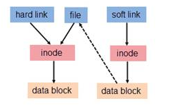

### linux常见工具

1. 帮助命令：whatis,info,whereis,type,man,which;man查看详细，-k可查看部分关键字。

2. 文件操作:

   - 删除日志 rm *log (等价: $find ./ -name “*log” -exec rm {} \;后面的分号不能少。{}代表前面查出来的文件名，然后要删除可以先配合ls查看是否是要删除的文件。分号前的空格必须有。
   - 复制目录：cp -r ；
   - wc统计单词或者行数。find ./ | wc -l查看当前目录下的文件数目。
   - ls -lrt 按照文件修改时间排序;ls | cat -n文件名前面加行号。
   - **find ** find ./ -name "core*" | xargs file;xargs是将前面的输出当做参数传递给后面的命令。
   - locate更快，但是要更新数据updatedb。文件系统会建立索引数据库。
   - 查看cat vi head tail more diff显示文件的差别，diff以git格式显示文件改动。直接用git diff可以在本地查看改动，比git status好用。git diff --staged会比较被放入了暂存区的文件改动。git diff 0023cdd..fcd6199比较不同版本同分支的区别，git diff master..contact-form比较不同分支的改动。
   - ln cc ccAgain :硬连接；删除一个，将仍能找到；stat查看文件信息。
     ln -s cc ccTo :符号链接(软链接)；删除源，另一个无法使用；（后面一个ccTo 为新建的文件）

3.  文本处理(难)awk grep sed sort uniq 

   - find补充用法，按照类型-type f文件链接d目录; 按照时间-atime -mtime -ctime(access modi change);-size +2k大小　-user用户。!否定参数。-perm 644权限;-exec ./commands.sh {} \;执行命令。

   - grep "class" . -R -n递归搜索字符串(搜索代码)

   - sort按行排序，-r倒序。-d字典序;-kN第几列

   - xargs 参数转发

   - uniq去除重复行,-c统计,-d找出重复行。

   - tr转换字符 cut按列切分cut -f2,3保留23列。paste按列合并。

   - wc统计l行,w单词,c字符

   - seq产生连续数字

   - sed直接处理行，比如增加删除等2,$d删除第二行到末尾。sed文本替换神器sed 's/text/replace_text/g' file   //替换每一行匹配的text，-i改变源文件。sed '3a\add newline after 3rd line.' test  d删除

   - awk每一行作为输入参数处理: awk ' BEGIN{ statements } statements2 END{ statements } '

     $1第一个段

     ```shell
     echo -e "line1 f2 f3\n line2 \n line 3" | awk '{print NR":"$0"-"$1"-"$2}'
     awk '{print $2, $3}' file
     # awk实现head
     awk 'NR<=10{print}' filename
     # 实现tail
     awk '{buffer[NR%10] = $0;} END{for(i=0;i<11;i++){print buffer[i%10]}}' filename
     ```

4. 磁盘管理 df du

   - df -h du查看当前目录du -sh

   - tar -cvf etc.tar /etc <==仅打包，不压缩！-x解包

   - gzip压缩gunzip解压

     tar -z 解压gz文件
     -j 解压bz2文件
     -J 解压xz文件

5. 进程管理
   - ps -ef; ps -ajx;top; pmap分析线程堆栈。
   - lsof配合参数查看被打开的文件，比如lsof -p 2329查看进程打开的文件。-u指定任务