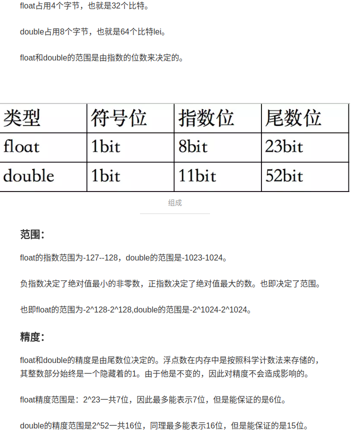
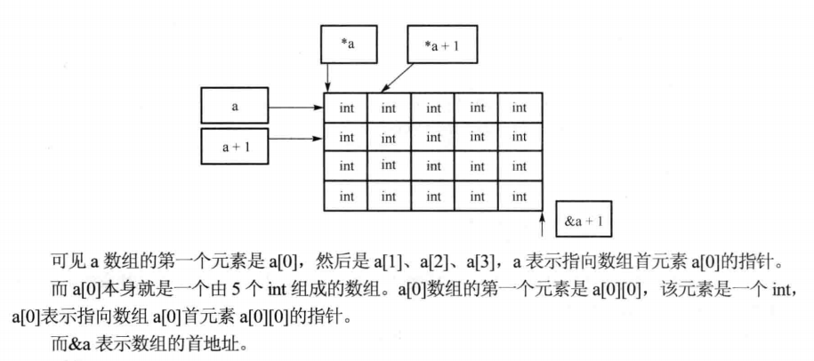

1. sizeof的原理：编译器求值关于sizeof的两个精巧的宏实现。
   非数组的sizeof:　#define _sizeof(T) ( (size_t)((T*)0 + 1))
   数组的sizeof:　#define array_sizeof(T)   ( (size_t)(&T+1)  - (size_t)(&T)  )

   对数组类型取地址，然后加１是跳过整个地址的操作。

2. 浮点数的表示，一个图说清楚，不能进行等于比较。

3. 数组的操作
4. 
